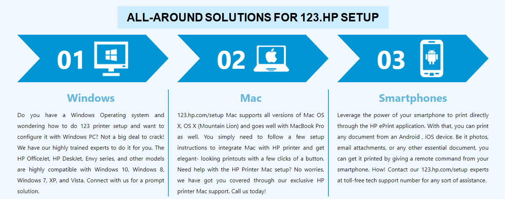

#############
123 hp setup
#############

|

    
|

HP printers are known worldwide for producing high quality printouts without bothering users. Although, like any other device, minor hiccups are quite normal, problems arise when the printer runs into major problems. Are you facing a similar situation? not a problem. Now reliable and dependable 123 hp setup is at your fingertips. We deal with it.

*************
QUICK STEPS FOR 123.HP/SETUP AND INSTALLATION
*************

1.Do a quick unboxing of your 123 hp setup printer.
2.Keep it in a clean and tidy place.
3.Make sure the printer, computer, and internet router are placed closed to each other (5 feet distance would be enough).
4.Ensure to remove tapes and packaging material from your printer.
5.Now connect your printer to the power supply using a cable.
6.Press the power button to turn on your printer, the green lights should illuminate and the printer should display Ready on screen.
7.Do a quick unboxing of your printer.
8.Keep it in a clean and tidy place.
9.Make sure the printer, computer, and internet router are placed closed to each other (5 feet distance would be enough).
10.Ensure to remove tapes and packaging material from your printer.
11.Now connect your printer to the power supply using a cable.
12.Press the power button to turn on your printer, the green lights should illuminate and the printer should display Ready on screen.

|

    
|

*************
123.HP/SETUP PRINTER USING WIRELESS NETWORK
*************

1.Turn on your printer and make sure you have completed the initial printer setup.
2.Navigate to the website 123 hp setup from your web browser.
3.A new window opens, here you will need to select your operating system.
4.Now enter your HP printer model and click Submit.
5.Go to the Driver Download section and click Download Drivers.
6.You will receive the driver installer in your Download folder.
7.Right-click on the file, click Install Now.
8.Now keep following the on-screen instructions as you might have to connect your printer to the computer with a USB cable.
9.Once the installation completes you will receive a notification message on your computer.
